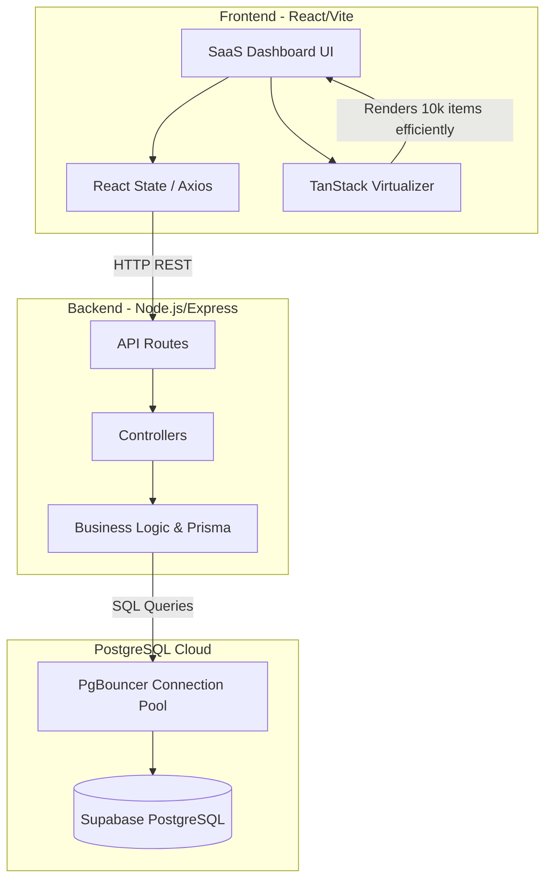

# Architecture & Design Decisions

This document outlines the architectural decisions and technical trade-offs made while building the ACME Salary Management software.

## 1. Monorepo vs Multi-repo
We chose a **Monorepo** approach (with `frontend/` and `backend/` folders in the same repository).
- **Why?** For a single full-stack assessment, it vastly simplifies code review, git history tracking, and local setup for the reviewer.
- **Trade-off**: In a massive enterprise application, scaling a monorepo requires advanced tooling (Turborepo, Nx). For this scale, a simple folder structure is sufficient and clean.

## 2. Frontend Virtualization
The requirement states the system must manage 10,000 employees. Rendering 10,000 DOM nodes in a standard React table will cause massive layout thrashing and crash the browser.
- **Decision**: Implemented UI Virtualization using `@tanstack/react-virtual`.
- **Why?** Virtualization only renders the rows visible in the viewport (e.g., ~20 rows at a time). As the user scrolls, the DOM nodes are recycled. This guarantees constant 60FPS scrolling performance regardless of the data size.
- **Trade-off**: Slightly higher complexity in building the table component compared to a standard `.map()` render.

## 3. PostgreSQL & Prisma ORM
- **Decision**: Use PostgreSQL as the relational database, managed via Prisma ORM.
- **Why?** PostgreSQL provides excellent performance for aggregations (needed for the analytics dashboard). Prisma offers unmatched developer experience (DX) and end-to-end type safety with TypeScript, eliminating runtime type errors.
- **Trade-off**: Prisma adds a slight overhead compared to raw SQL queries, but the speed of development and type safety heavily outweigh this for a CRUD/Analytics app.

## 4. Test-Driven Development (TDD)
- **Decision**: Tests are written using Jest (Backend) and Vitest (Frontend) before implementing core logic.
- **Why?** Aligns with the Extreme Programming (XP) culture at Incubyte. Ensuring the API handles pagination, filtering, and edge cases gracefully.

## 5. Excluded Features (Scope Management)
As defined in the `requirements.md`, we intentionally excluded Authentication and Historical Salary tracking to ensure we deliver a highly polished, performant core experience without getting bogged down in boilerplate logic that detracts from the primary goal.

## 6. System Architecture Diagram

